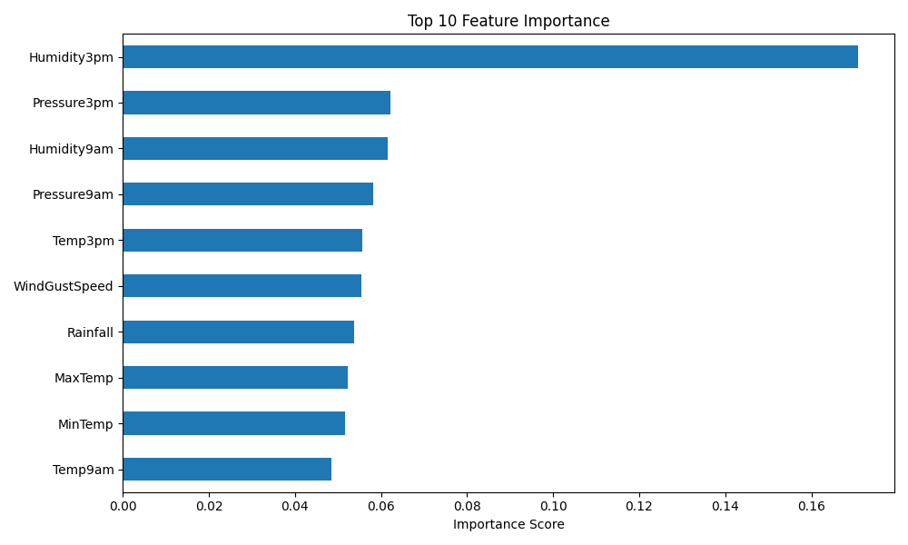
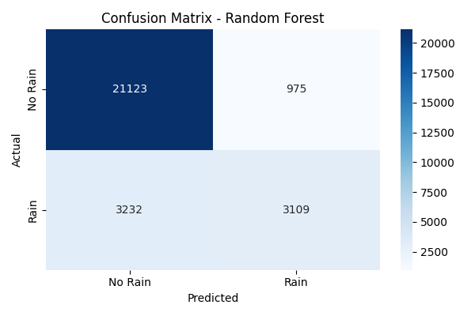

# Rainfall Prediction Using Machine Learning

## Project Overview :-

This project uses Machine Learning techniques to predict whether it will rain tomorrow based on historical weather data from Australia.

The dataset contains over 145,000 weather observations, including temperature, humidity, pressure, wind speed, rainfall, and other meteorological measurements. The goal is to build a predictive model that can classify whether rain will occur on the following day.

---

## Objective :-

Predict the target variable:

**RainTomorrow**

* Yes → Rain expected tomorrow
* No → No rain expected tomorrow

---

## Dataset Information :-

* Dataset: Rain in Australia Weather Dataset
* Total Records: ~145,000
* Original Features: 23
* Final Features After Preprocessing: 107+
* Target Variable:  "RainTomorrow"

---

## Data Preprocessing :-

The following preprocessing steps were performed:

### 1. Handling Missing Values

* Removed columns with excessive missing values:
  * Evaporation
  * Sunshine
  * Cloud9am
  * Cloud3pm

### 2. Numerical Data Imputation

Missing numerical values were filled using the  **median** .

### 3. Categorical Data Imputation

Missing categorical values were filled using the  **mode** .

### 4. Feature Encoding

Applied **One-Hot Encoding** to categorical variables such as:

* Location
* Wind Direction
* RainToday

### 5. Feature Scaling

Applied **StandardScaler** to normalize numerical features before model training.

---

## Machine Learning Models :-

### Logistic Regression

Results:

* Accuracy: ~84%
* Precision (Rain): 72%
* Recall (Rain): 49%
* F1 Score (Rain): 59%

### Random Forest Classifier

Results:

* Accuracy: ~85.2%
* Precision (Rain): 76%
* Recall (Rain): 49%
* F1 Score (Rain): 60%

Random Forest achieved the best overall performance and was selected as the final model.

---

## Model Evaluation :-

Evaluation metrics used:

* Accuracy
* Precision
* Recall
* F1 Score
* Confusion Matrix

### Confusion Matrix (Random Forest)

| Actual / Predicted | No Rain | Rain |
| ------------------ | ------- | ---- |
| No Rain            | 21123   | 975  |
| Rain               | 3232    | 3109 |

---

## Feature Importance Analysis :-

The most influential features identified by the Random Forest model were:

1. Humidity3pm
2. Pressure3pm
3. Humidity9am
4. Pressure9am
5. Temp3pm
6. WindGustSpeed
7. Rainfall
8. MaxTemp
9. MinTemp
10. Temp9am

These variables contributed the most to rainfall prediction.

---

## Visualizations :-

### Feature Importance Chart

Shows the top weather factors influencing rainfall prediction.

### Confusion Matrix

Visualizes model performance and classification results.

---

## Technologies Used :-

* Python
* Pandas
* NumPy
* Matplotlib
* Scikit-Learn

---

## Key Learning Outcomes :-

Through this project, I learned:

* Data Cleaning and Preprocessing
* Missing Value Treatment
* Feature Engineering
* One-Hot Encoding
* Feature Scaling
* Train-Test Split
* Logistic Regression
* Random Forest Classification
* Model Evaluation Metrics
* Feature Importance Analysis

---

## Conclusion :-

This project demonstrates a complete Machine Learning workflow, from data preprocessing to model evaluation. Among the models tested, Random Forest provided the best performance with an accuracy of approximately 85%, while humidity and atmospheric pressure emerged as the strongest predictors of rainfall.

The project highlights how Machine Learning can be used to support weather prediction and decision-making using historical meteorological data.
